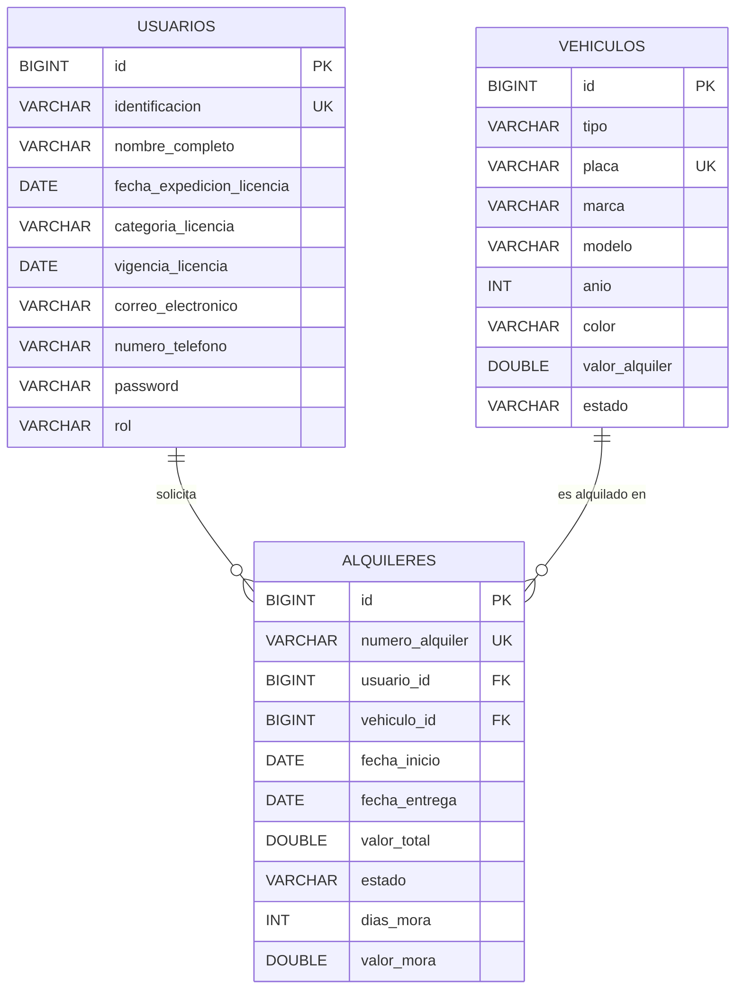
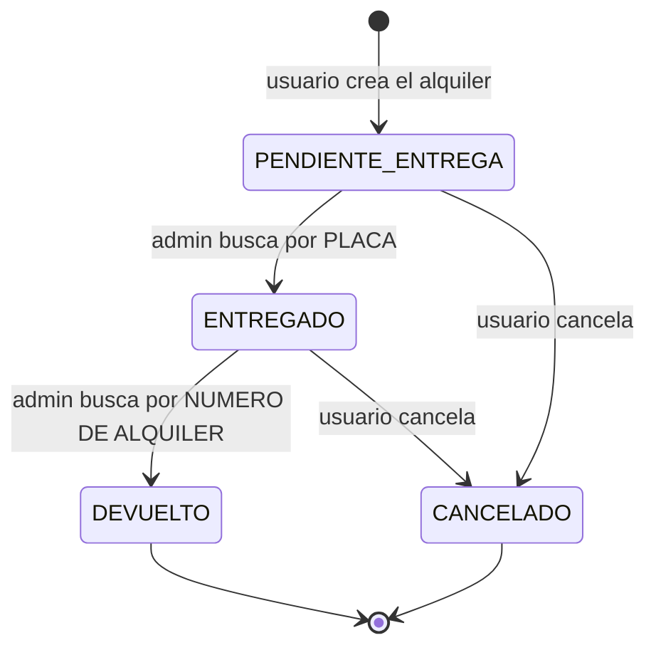

# MR — Modelo Relacional

**Proyecto:** Mi Cacharrito — Sistema de alquiler de vehículos
**Asignatura:** Programación Web 2 · Ingeniería Informática · Universidad de Caldas
**Base de datos:** MySQL 8.0 · `micacharrito`

---

## 1. Identificación de entidades

| Entidad | Descripción |
|---|---|
| **usuarios** | Personas que se registran en el sistema (clientes) y el administrador. Guarda los datos de la licencia de conducción. |
| **vehiculos** | Flota de la empresa. Puede ser automóvil, camioneta, campero, microbús o motocicleta. |
| **alquileres** | Registro de cada solicitud de alquiler hecha por un usuario sobre un vehículo. Es la entidad de unión (relación débil) entre `usuarios` y `vehiculos`. |

---

## 2. Atributos de cada entidad

### 2.1 `usuarios`

| Atributo | Tipo | Restricción | Descripción |
|---|---|---|---|
| `id` | `BIGINT` | **PK**, AUTO_INCREMENT | Identificador interno |
| `identificacion` | `VARCHAR(255)` | **UNIQUE**, NOT NULL | Número de identificación (cédula/pasaporte) |
| `nombre_completo` | `VARCHAR(255)` | NOT NULL | Nombre completo |
| `fecha_expedicion_licencia` | `DATE` | NOT NULL | Fecha de expedición de la licencia |
| `categoria_licencia` | `VARCHAR(255)` | NOT NULL | Categoría (A, B1, B2, C1, …) |
| `vigencia_licencia` | `DATE` | NOT NULL | Vigencia de la licencia |
| `correo_electronico` | `VARCHAR(255)` | NOT NULL | Correo electrónico |
| `numero_telefono` | `VARCHAR(255)` | NOT NULL | Número de teléfono |
| `password` | `VARCHAR(255)` | NOT NULL | Contraseña cifrada con **BCrypt** |
| `rol` | `VARCHAR(10)` | NOT NULL, default `USUARIO` | `USUARIO` o `ADMIN` |

### 2.2 `vehiculos`

| Atributo | Tipo | Restricción | Descripción |
|---|---|---|---|
| `id` | `BIGINT` | **PK**, AUTO_INCREMENT | Identificador interno |
| `tipo` | `VARCHAR(20)` | NOT NULL, ENUM | `AUTOMOVIL`, `CAMIONETA`, `CAMPERO`, `MICROBUS`, `MOTOCICLETA` |
| `placa` | `VARCHAR(255)` | **UNIQUE**, NOT NULL | Número de placa |
| `marca` | `VARCHAR(255)` | NOT NULL | Marca |
| `modelo` | `VARCHAR(255)` | NOT NULL | Modelo |
| `anio` | `INT` | NOT NULL | Año |
| `color` | `VARCHAR(255)` | NOT NULL | Color |
| `valor_alquiler` | `DOUBLE` | NOT NULL | Valor del alquiler **por día** |
| `estado` | `VARCHAR(20)` | NOT NULL, default `DISPONIBLE` | `DISPONIBLE` o `ALQUILADO` |

### 2.3 `alquileres`

| Atributo | Tipo | Restricción | Descripción |
|---|---|---|---|
| `id` | `BIGINT` | **PK**, AUTO_INCREMENT | Identificador interno |
| `numero_alquiler` | `VARCHAR(255)` | **UNIQUE**, NOT NULL | Número visible del alquiler (`ALQ-XXXXXXXX`) |
| `usuario_id` | `BIGINT` | **FK → usuarios.id**, NOT NULL | Usuario que solicita |
| `vehiculo_id` | `BIGINT` | **FK → vehiculos.id**, NOT NULL | Vehículo alquilado |
| `fecha_inicio` | `DATE` | NOT NULL | Fecha de inicio del alquiler |
| `fecha_entrega` | `DATE` | NOT NULL | Fecha pactada de entrega |
| `valor_total` | `DOUBLE` | NOT NULL | Valor total (incluye mora si la hay) |
| `estado` | `VARCHAR(20)` | NOT NULL, default `PENDIENTE_ENTREGA` | Ver sección 4 |
| `dias_mora` | `INT` | NOT NULL, default `0` | Días extras cobrados |
| `valor_mora` | `DOUBLE` | NOT NULL, default `0` | Valor cobrado por mora |

---

## 3. Diagrama entidad-relación



### Representación textual

```
USUARIOS ( id, identificacion, nombre_completo, fecha_expedicion_licencia,
           categoria_licencia, vigencia_licencia, correo_electronico,
           numero_telefono, password, rol )

VEHICULOS ( id, tipo, placa, marca, modelo, anio, color,
            valor_alquiler, estado )

ALQUILERES ( id, numero_alquiler, usuario_id*, vehiculo_id*, fecha_inicio,
             fecha_entrega, valor_total, estado, dias_mora, valor_mora )
```

### Cardinalidades

| Relación | Cardinalidad | Lectura |
|---|---|---|
| `usuarios` → `alquileres` | **1 : N** | Un usuario puede tener muchos alquileres; cada alquiler pertenece a un solo usuario. |
| `vehiculos` → `alquileres` | **1 : N** | Un vehículo puede ser alquilado muchas veces; cada alquiler corresponde a un solo vehículo. |
| `usuarios` → `vehiculos` | **N : M** (resuelta por `alquileres`) | Un usuario alquila muchos vehículos y un vehículo es alquilado por muchos usuarios. |

---

## 4. Dominio de estados

### `alquileres.estado`



| Estado | Significado |
|---|---|
| `PENDIENTE_ENTREGA` | El usuario solicita el alquiler; el vehículo pasa a `ALQUILADO` pero aún no se le ha entregado. |
| `ENTREGADO` | El administrador entregó el vehículo al usuario (búsqueda por **placa**). |
| `DEVUELTO` | El usuario devolvió el vehículo; el vehículo vuelve a `DISPONIBLE` y, si corresponde, se cobra la mora (búsqueda por **número de alquiler**). |
| `CANCELADO` | El usuario canceló el alquiler; el vehículo vuelve a `DISPONIBLE`. |

### `vehiculos.estado`

| Estado | Significado |
|---|---|
| `DISPONIBLE` | Se puede alquilar. |
| `ALQUILADO` | Tiene un alquiler activo (`PENDIENTE_ENTREGA` o `ENTREGADO`). |

---

## 5. Reglas de negocio derivadas

1. **Valor del alquiler** = `valor_alquiler × días`, con `días = fecha_entrega − fecha_inicio` (mínimo 1 día).
2. **Mora** = `valor_alquiler × días_de_atraso`, donde `días_de_atraso = hoy − fecha_entrega` cuando `hoy > fecha_entrega`. Se suma a `valor_total` al momento de la devolución.
3. Un vehículo `ALQUILADO` no puede recibir un segundo alquiler.
4. Solo se puede cancelar un alquiler que no esté en estado `DEVUELTO` ni `CANCELADO`.
5. `identificacion` y `placa` son claves alternativas (únicas): garantizan que no haya usuarios duplicados ni placas repetidas.
6. `numero_alquiler` es único para poder localizar cualquier alquiler desde el panel del administrador.

---

## 6. Archivos relacionados

- Script SQL de creación: [`script-mysql.sql`](./script-mysql.sql)
- Entidades JPA: `backend/src/main/java/com/micacharrito/modelo/`
- Repositorios: `backend/src/main/java/com/micacharrito/repositorio/`
